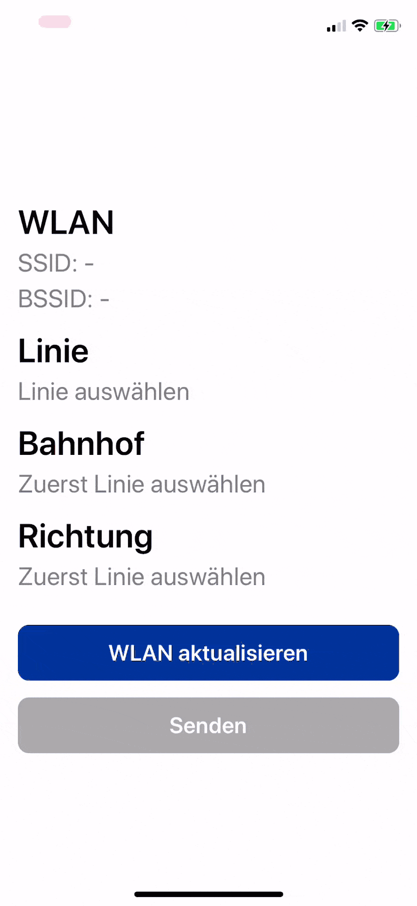

# BVG WiFi recording app

A tiny app that lets you map [BVG](https://www.bvg.de/) (Berlin's subway operator) subway WiFi BSSIDs to subway station IDs to contribute them to our [*open data collection (todo)*](#) which could then - in the future - be used in context-sensitive public transport apps.

The app is only available via TestFlight (for now), let me know at [`mail@juliustens.eu`](mailto:mail@juliustens.eu) if you're interested in using it.

## Demo

## Usage

You can adapt this app for your own area or public transport operator rather quickly by following these steps:

- Adapt XCode metadata (e.g. app identifier, …)
- Update the transit network information: Lines, stations and directions are currently stored in [`stations.json`](BVGWifiRecorder/stations.json), the structure of that file is rather self-explanatory.
- Update the app configuration: All settings are stored in [`Config.swift`](BVGWifiRecorder/Config.swift). You can change or deactivate the WiFi SSID whitelist, adapt the backend endpoints, or change the UI text labels

## Disclaimer

Please note that as this is both one of my first Swift projects as well as made in a very short period of time, some things are probably implemented in a less-than-perfect way.

Also, the app probably isn't very accessible or responsive (yet).

## Contributing

If you found a bug or want to propose a feature, feel free to visit [the issues page](https://github.com/juliuste/bvg-wifi-recording-app/issues).
